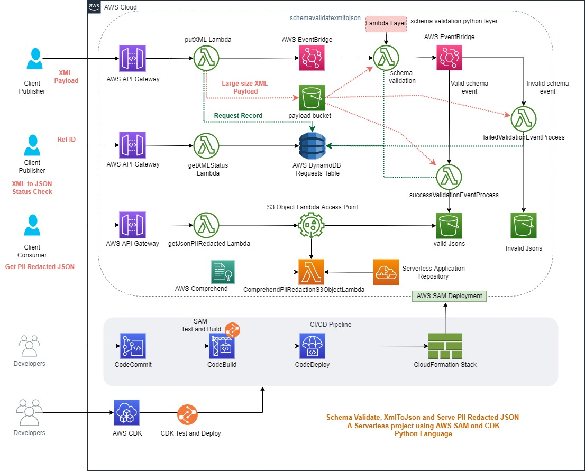

# schemavalidatexmltojson
This project is a serverless based schema validation, xml to json conversion and finally publishes the json data to consumers along with PII Redaction.

1. Application accept a xml payload via API Gateway, the request will be processed by AWS Lambda function. If payload is very large XML(more than 1 mb), then payload will be stored in a S3 bucket. Request will be logged into AWS DynamoDB. Lambda function will farward this request AWS EventBridge for further processing and retruns back a Reference ID to caller.
2. Schema Validation lambda function will be called via EventBridge and it will convert XML payload(if large payload then first copy xml from S3 bucket) into JSON and validate the JSON against predefined Schema. Lambda will update the status into DynamoDB and finally publishes result to EventBridge.
3. Based on the validation status, a lambda function will be called and it will push converted JSON into respective S3 bucket and update request status into DynamoDB.
4. Meanwhile, caller can another API(xmlstatus) with Reference ID to check the status of the request. Lambda function will query into DynamoDB table and return back the status.
5. Once a valid JSON is ready, a consumer can call another API(getJsonPIIRedacted) backed by lambda function which will further call S3 Object Lambda Access Point which is backed by "ComprehendPiiRedactionS3ObjectLambda" function from Lambda Application Repository. This will ensure that JSON object from S3 bucket is PII Redacted before returned to consumers.

# Technology
- We have used AWS SAM (Serverless Appplication Model) to create infrastructure of this project. We have Python SDK to build lambda functions. Unit Testing will be performed locally using moto library to mock AWS Services.
- We have create CI/CD Pipeline for this project using AWS CDK in Python Language. There is local unit testing for CDK as well before deploying the pipeline to AWS Cloud.

## Architecture



The project contains source code and supporting files for schemavalidatexmltojson application that you can deploy with the SAM CLI. It includes the following files and folders.

- putXml - Code for Submit XML payload for validation and conversion.
- xmlStatus - Code for checking status XML payload submitted for validation.
- schemavalidator - Code for validation of XML and convert into json object.
- failedValidationEventProcess - Code for handling failed validation XML payload.
- successValidationEventProcess - Code for handling successful validation XML payload.
- getJsonPIIRedacted - Code for providing XML conveted json along with PII Redacted.
- events - Invocation events that you can use to invoke the function.
- tests - Unit tests for the application code. 
- template.yaml - A template that defines the application's AWS resources.
- buildspec.yaml - A template that defines build steps in CI/CD pipeline.
- pipeline - A cdk backed CI/CD pipeline for schemavalidatexmltojson application.
- install.bat - A quick Windows cmd script to run test and deploy SAM.


## Deploy the schemavalidatexmltojson application
To use the SAM CLI, you need the following tools.
* SAM CLI - [Install the SAM CLI](https://docs.aws.amazon.com/serverless-application-model/latest/developerguide/serverless-sam-cli-install.html)
* [Python 3 installed](https://www.python.org/downloads/)
* Docker - [Install Docker community edition](https://hub.docker.com/search/?type=edition&offering=community)
* Create Virtual Env.
```bash
python -m venv .venv

```
## Deploy using SAM Template directly using Windows CMD Script.
* Run `install.bat` to test, build and Deploy SAM Templates.

## Deploy SAM Template directly via CI/CD Pipeline
* Go to [pipeline/README.md](pipeline/README.md) and follow the instruction.

## Architecture


## Sample API Requests/Response

## More Readings.
To build and deploy your application for the first time, run the following in your shell:

```bash
sam build
sam deploy --guided
```
The first command will build the source of your application. The second command will package and deploy your application to AWS, with a series of prompts:
* **Stack Name**: The name of the stack to deploy to CloudFormation. This should be unique to your account and region, and a good starting point would be something matching your project name.
* **AWS Region**: The AWS region you want to deploy your app to.
* **Confirm changes before deploy**: If set to yes, any change sets will be shown to you before execution for manual review. If set to no, the AWS SAM CLI will automatically deploy application changes.
* **Allow SAM CLI IAM role creation**: Many AWS SAM templates, including this example, create AWS IAM roles required for the AWS Lambda function(s) included to access AWS services. By default, these are scoped down to minimum required permissions. To deploy an AWS CloudFormation stack which creates or modifies IAM roles, the `CAPABILITY_IAM` value for `capabilities` must be provided. If permission isn't provided through this prompt, to deploy this example you must explicitly pass `--capabilities CAPABILITY_IAM` to the `sam deploy` command.
* **Save arguments to samconfig.toml**: If set to yes, your choices will be saved to a configuration file inside the project, so that in the future you can just re-run `sam deploy` without parameters to deploy changes to your application.

You can find your API Gateway Endpoint URL in the output values displayed after deployment.

## Use the SAM CLI to build and test locally

Build your application with the `sam build` command.

```bash
schemavalidatexmltojson$ sam build
```

The SAM CLI installs dependencies defined in `<lambdafunction_folder>/requirements.txt`, creates a deployment package, and saves it in the `.aws-sam/build` folder.

Test a single function by invoking it directly with a test event. An event is a JSON document that represents the input that the function receives from the event source. Test events are included in the `events` folder in this project.

Run functions locally and invoke them with the `sam local invoke` command.

```bash
schemavalidatexmltojson$ sam local invoke xmlStatus --event events/event.json
```

The SAM CLI can also emulate your application's API. Use the `sam local start-api` to run the API locally on port 3000.

```bash
schemavalidatexmltojson$ sam local start-api
schemavalidatexmltojson$ curl http://localhost:3000/
```
## Fetch, tail, and filter Lambda function logs

To simplify troubleshooting, SAM CLI has a command called `sam logs`. `sam logs` lets you fetch logs generated by your deployed Lambda function from the command line. In addition to printing the logs on the terminal, this command has several nifty features to help you quickly find the bug.

`NOTE`: This command works for all AWS Lambda functions; not just the ones you deploy using SAM.

```bash
schemavalidatexmltojson$ sam logs -n xmlStatus --stack-name schemavalidatexmltojson --tail
```
## Tests

Tests are defined in the `tests` folder in this project. Use PIP to install the test dependencies and run tests.

```bash
schemavalidatexmltojson$ pip install -r tests/requirements.txt --user
# unit test
schemavalidatexmltojson$ coverage run -m pytest tests\unit
```

## Deploy 
Deploy your application with the `sam deploy` command.

```bash
schemavalidatexmltojson$ sam deploy
```


## CI/CD using CDK
Cloud Development Kit with Python for creating CI/CD pipeline for our SAM Project.
- pipeline - Code for pipeline stack.
- tests - Code for testing pipeline stack without even deploying the stack.
- app.py - initialization code for CDK.
- cdk.json - started script for CDK.
- requirements.txt - python packages for CDK.
- requirements-dev.txt - python packaged for CDK testing.
### Testing 
```bash
schemavalidatexmltojson/pipeline$ source .venv/bin/activate
schemavalidatexmltojson/pipeline$ pytest
```

### Changeset to deploy
```bash
schemavalidatexmltojson/pipeline$ cdk diff
```

### Changeset to deploy
```bash
schemavalidatexmltojson/pipeline$ cdk deploy
```

## Cleanup

To delete the application, use the AWS CLI. Assuming you used your project name for the stack name, you can run the following:

```bash
aws cloudformation delete-stack --stack-name schemavalidatexmltojson
```

To delete CDK based Pipeline 
```bash
schemavalidatexmltojson/pipeline$ cdk destroy
schemavalidatexmltojson/pipeline$ aws codecommit delete-repository --repository-name schemavalidatexmltojson
```
